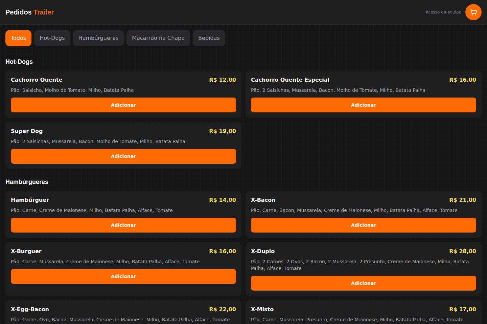
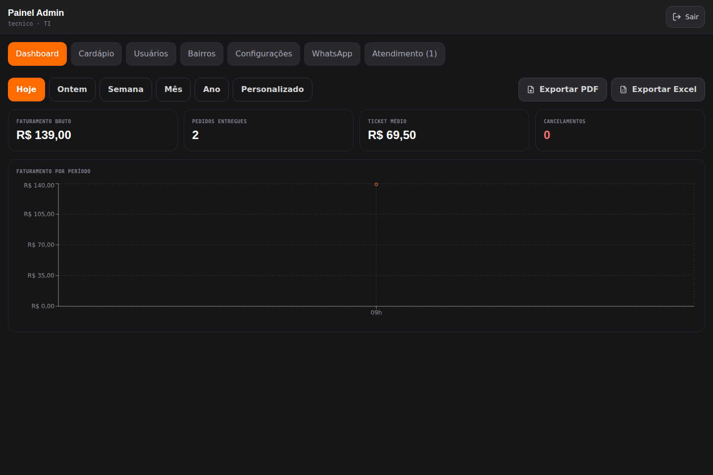
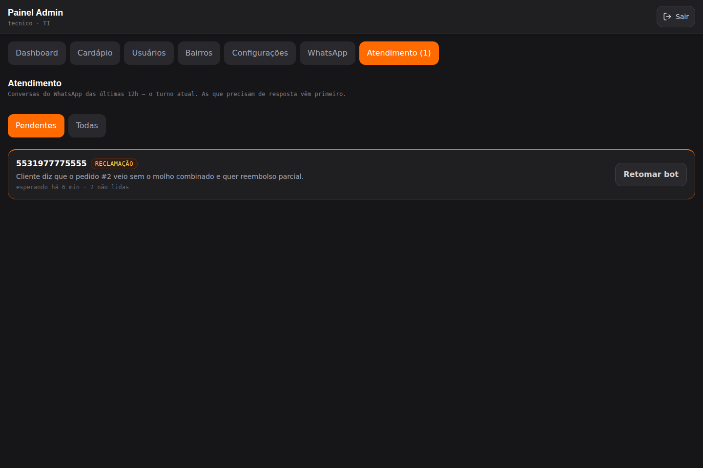
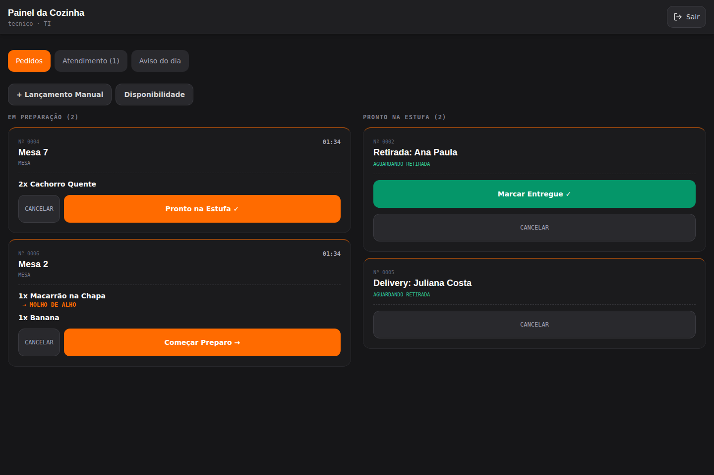
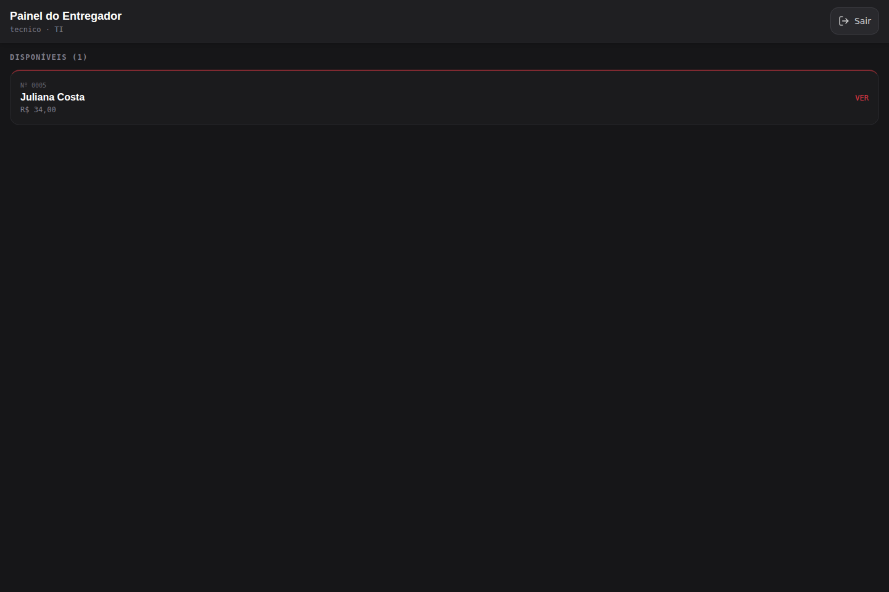
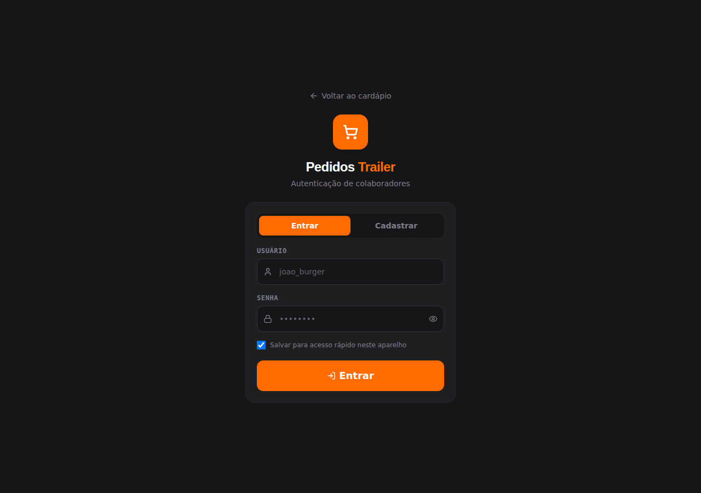

# Sistema de Pedidos Trailer — Sistema de Pedidos com Bot de WhatsApp

Aplicação web completa para um trailer de lanches: cardápio público para o cliente pedir pelo celular, painéis internos por função (garçom, cozinha, entregador, administrador, TI) com atualização em tempo real, exportação de relatório em PDF e Excel, e um atendente virtual no WhatsApp que recebe pedidos usando a API oficial da Meta e um modelo da OpenAI com *tool calling*.

Projeto de produção, pensado para ser usado ao vivo durante o expediente (18h às 05h), que atravessa a meia-noite. Cada decisão de arquitetura documentada em `docs/CONTEXTO.md` nasceu de um problema real: pedido duplicado, virada de dia no meio do turno, aritmética de dinheiro em ponto flutuante, vazamento de dados pessoais por socket.

Esta é uma cópia de portfólio: mesmo código e mesmas regras de negócio do sistema original, com nome, identidade visual, telefone e Instagram trocados por um exemplo neutro — nada aqui identifica o negócio real por trás do projeto.

## O problema que ele resolve

Um trailer de lanches sem sistema roda de duas formas, e as duas custam caro:

- **No papel.** Pedido anotado à mão, preço somado de cabeça (ou errado), sem histórico de quem pediu o quê, sem como saber o que mais vendeu no mês. Fechar o caixa do dia significa juntar comandas de papel e recontar tudo.
- **Passando pra planilha depois.** Para ter qualquer relatório — faturamento da semana, item mais vendido, comparação entre dias — alguém precisa pegar as comandas do dia (ou da semana) e digitar cada linha numa planilha, à mão. Num trailer com movimento real, isso consumia **um dia inteiro de trabalho por rodada**.

Este sistema substitui as duas coisas. O pedido nasce digital — pelo cliente no cardápio público, pelo garçom na mesa, ou pelo cliente no WhatsApp — e o relatório sai pronto:

- **Exportar Excel**, com um clique, no painel do administrador: pega o período (hoje, ontem, semana, mês, ano ou uma data escolhida) e gera a planilha na hora — sem copiar linha por linha, sem re-somar nada, sem esperar o dia da planilha. O que levava um dia vira um clique.
- **Exportar PDF** do mesmo período, pronto pra imprimir ou mandar por mensagem.
- **Bot de WhatsApp pela API oficial da Meta**, que atende o cliente, monta o pedido, calcula o total certo e cria o pedido direto no sistema — sem ninguém precisar copiar um pedido que chegou por mensagem para dentro do sistema à mão.

Não é um ERP de rede de restaurante — é dimensionado pro tamanho real de um trailer (~10 pessoas de equipe, um caixa, um turno). Mas comparado a papel e planilha manual, é o salto de não ter sistema nenhum para ter um.

## Capturas de tela

Sistema rodando localmente, com dados de exemplo — sem nenhuma informação real de cliente.

**Cardápio público**, aberto direto no celular do cliente, sem instalar nada:



**Painel do administrador** — faturamento do período, gráfico e os dois botões de exportação (PDF e **Excel**):



**Atendimento via WhatsApp** — quando o bot esbarra em algo que só um humano resolve (reclamação, bairro fora da área, pedido agendado), ele passa a conversa pra fila do painel, com o motivo já resumido:



**Painel da cozinha** — fila por status, sem filtro de data (o turno atravessa a meia-noite):



**Painel do entregador** — pedidos prontos pra sair, aceite atômico (dois entregadores nunca pegam o mesmo pedido):



**Login** dos colaboradores, por papel:



## O que o sistema faz

**Cardápio público (`/`)**
- Cardápio por categoria, itens com escolha obrigatória (ex.: sabor do molho) e acréscimos.
- Carrinho e checkout para mesa, retirada ou delivery, com taxa por bairro.
- Reflete em tempo real se o trailer está aberto, se o delivery está ativo e se um item saiu do estoque.

**Painéis internos (`/painel/*`, com login)**
- **Garçom**: lança pedidos, confirma pedidos feitos pelo site em mesa.
- **Cozinha**: fila por status (`AGUARDANDO → PREPARANDO → PRONTO`), controle de disponibilidade de itens.
- **Entregador**: aceita entregas com atribuição atômica (dois entregadores nunca pegam o mesmo pedido), reporta problemas.
- **ADM**: dashboard com KPIs e gráfico de faturamento, **exportação de relatório em PDF e Excel**, gestão de cardápio, bairros, usuários, avisos do dia, horário de fechamento agendado, fila de atendimento humano do WhatsApp.
- **TI**: logs de auditoria com filtro e exportação (CSV/JSON), conexão do WhatsApp.

**Exportação de relatório**
- **Excel (.xlsx)**: gerador próprio (sem depender de serviço externo), com abas de dados brutos e de resumo com rótulos legíveis, nas cores do site.
- **PDF**: mesmo período, pronto pra imprimir.
- Período escolhido na hora: hoje, ontem, semana, mês, ano, ou um intervalo customizado.

**Bot de WhatsApp (API oficial da Meta + OpenAI)**
- Webhook da Meta com verificação de assinatura sobre o corpo bruto da requisição — não é WhatsApp não-oficial nem depende de um celular conectado por QR code.
- Loop de *tool calling* com a OpenAI: `criar_pedido`, `consultar_pedido_ativo`, `cancelar_pedido_ativo`, `transferir_para_humano`.
- Caixa de entrada de atendimento no painel: quando o bot transfere a conversa, ela entra numa fila priorizada por quem precisa de resposta, com o motivo do handoff já resumido — o atendente não precisa reler a conversa inteira.
- Mensagem enviada pelo painel rastreia estado (`PENDENTE` → `ENVIADA`/`FALHOU`) — nunca fica "sumida" se a API da Meta falhar.
- *Embedded Signup* com coexistência: o número que já usa o app WhatsApp Business conecta pelo painel, e o token da conta fica cifrado em repouso no banco.
- O bot é opcional por construção: sem as credenciais dele, o cardápio e os pedidos continuam no ar.

## Stack

| Camada | Tecnologias |
|---|---|
| Backend | Node.js 20, TypeScript, Express 4, Prisma 6, PostgreSQL, Socket.IO 4, Zod, JWT + bcrypt, express-rate-limit |
| Frontend | React 19, TypeScript, Vite, React Router 6, Zustand, Tailwind CSS 3, socket.io-client, axios, Recharts, jsPDF |
| Integrações | WhatsApp Cloud API (Meta), OpenAI (chat completions com tools) |
| Infra | Um único container (Express serve a build do Vite), Railway, backup por `pg_dump` agendado |

## Arquitetura em poucas linhas

- **Um deploy, um domínio.** O Express serve a API em `/api/*`, o Socket.IO e os arquivos estáticos do frontend. Sem CORS, sem segundo pipeline.
- **Servidor é a fonte de verdade do dinheiro.** Preços vêm do banco pelo `menuItemId`; qualquer total enviado pelo cliente é ignorado. Backend calcula com `Prisma.Decimal`, frontend em centavos inteiros.
- **Snapshots no pedido.** Nome, preço e taxa de entrega são copiados para o pedido no momento da criação. Mudar o cardápio depois não altera histórico financeiro — nem o relatório que já foi exportado.
- **Painéis operacionais filtram por status, nunca por data.** O turno atravessa a meia-noite; filtrar por "hoje" faria a fila da cozinha sumir às 00:00.
- **Dois namespaces de socket.** `/staff` exige JWT no handshake e recebe eventos de pedido. `/public` é anônimo e só recebe disponibilidade de item e configuração pública. Nenhum dado de pedido cruza para o público.
- **Sem hard delete em objeto de domínio.** Item de cardápio é arquivado, bairro é desativado, pedido é cancelado com motivo obrigatório. Toda mudança de status grava histórico na mesma transação.
- **Login não revela se o usuário existe.** Usuário inexistente e senha errada retornam a mesma resposta.

## Estrutura

```
backend/
  prisma/            schema, migrations e seed (cardápio e bairros)
  src/modules/       auth, menu, neighborhoods, config, orders, public, users, logs, reports, whatsapp
  src/socket/        namespaces /staff e /public
  src/utils/         dinheiro, telefone, janela de delivery, expediente, cifra de token
  scripts/           backup-db.sh (pg_dump para object storage)
frontend/
  src/pages/         cardápio público, login, cinco painéis
  src/components/    admin, cart, menu, order, whatsapp, ui
  src/stores/        Zustand (auth, carrinho, catálogo, pedidos, socket, inbox e thread do WhatsApp)
  src/utils/         reportXlsx.ts + xlsxWriter.ts (exportação Excel), orderReportPdf.ts (PDF)
docs/
  CONTEXTO.md        arquitetura, schema, regras de negócio e decisões tomadas
  ESTILO.md          sistema visual
  BOT-WHATSAPP-PROMPT.md  system prompt e definição das tools do bot
  FASE-*.md          especificação de cada fase de desenvolvimento
  relatorios/        relatório de entrega de cada fase
  verificacoes/      saída bruta dos testes manuais de cada fase
  screenshots/        imagens usadas neste README
```

## Rodando localmente

Passo a passo completo — qualquer pessoa com Node e PostgreSQL consegue subir uma cópia local a partir daqui.

Pré-requisitos: Node 20+, PostgreSQL acessível (local, Docker, ou um serviço gerenciado).

```bash
# banco (exemplo com Postgres local já instalado)
createdb pedidos_trailer_dev

# backend
cd backend
cp .env.example .env
# edite .env: DATABASE_URL apontando pro banco acima, e gere um JWT_SECRET
#   openssl rand -base64 48
npm install                 # roda prisma generate no postinstall
npx prisma migrate deploy   # cria todas as tabelas
npx prisma db seed          # cria o usuário "tecnico" (senha admin123, TROQUE em produção) + cardápio + bairros
npm run dev                 # http://localhost:3000

# frontend (outro terminal)
cd frontend
npm install
npm run dev                 # http://localhost:5173, com proxy pra API em /api
```

Login inicial: usuário `tecnico`, senha `admin123`, papel TI (acesso a todos os painéis). Troque a senha antes de qualquer uso real.

Build de produção via `Dockerfile` na raiz (multi-stage: build do frontend, build do backend, runtime com `prisma migrate deploy` no start) — é o que roda, por exemplo, num serviço do Railway.

### Variáveis de ambiente

Obrigatórias: `DATABASE_URL`, `JWT_SECRET`. Opcionais: `JWT_EXPIRES_IN`, `PORT`, `NODE_ENV`, `TZ` (padrão `America/Sao_Paulo`).

Bot de WhatsApp (todas opcionais; cada uma é checada no ponto de uso, não no boot — sem elas o cardápio e os pedidos continuam funcionando normalmente): `META_APP_ID`, `META_APP_SECRET`, `META_VERIFY_TOKEN`, `META_ACCESS_TOKEN`, `META_PHONE_NUMBER_ID`, `OPENAI_API_KEY`, `OPENAI_MODEL`, `WHATSAPP_TOKEN_ENCRYPTION_KEY`. No frontend, `VITE_META_APP_ID` e `VITE_META_ES_CONFIG_ID` entram no bundle em tempo de build.

Detalhes de cada variável em `backend/.env.example` e `frontend/.env.example`.

### Verificações

O projeto não usa framework de teste. A lógica pura mais sensível tem *self-checks* executáveis:

```bash
cd backend
npx tsx src/utils/dateLogic.selfcheck.ts          # corte de delivery, tolerância, fronteira de expediente
npx tsx src/modules/reports/reports.selfcheck.ts  # matemática de dinheiro e validação de período

cd frontend
node --experimental-strip-types scripts/periods.selfcheck.ts  # fronteiras de semana/mês/ano
```

Os testes de integração de cada fase foram feitos contra o servidor real e a saída está em `docs/verificacoes/`.

## API

```
POST   /api/auth/register | /login          público, com rate limit
GET    /api/public/menu | /neighborhoods | /config
POST   /api/public/orders                   sem login, rate limit estrito

GET    /api/orders                          escopo por papel
POST   /api/orders                          GARCOM, CHAPISTA, ADM, TI
PATCH  /api/orders/:id/status | /confirm | /accept | /problem

GET/POST/PATCH /api/menu, /api/neighborhoods, /api/config
GET/PATCH/DELETE /api/users                 ADM, TI
GET    /api/logs, /api/logs/export          TI
GET    /api/reports/summary                 ADM, TI
GET/POST /api/webhook/whatsapp              Meta (verificação e recebimento)
GET/POST/PATCH /api/webhook/whatsapp/conversations/*  caixa de entrada de atendimento (GARCOM, CHAPISTA, ADM, TI)
```

Tabela completa, transições de status por papel e limites de rate limit em `docs/CONTEXTO.md`, seção 7.

## Fases entregues

1 a 9: backend e frontend do núcleo. 10: backup e deploy. 11: fechamento agendado do trailer. 12: bairro personalizado em pedido interno. 13: webhook do WhatsApp. 14: loop com OpenAI e resposta real. 15: Embedded Signup e coexistência de número. 16: correções da primeira rodada de testes do bot. 17: caixa de entrada de atendimento humano (thread, mensagem pendente, despausa automática) e exportação de relatório em Excel.

Relatório de cada fase em `docs/relatorios/`. Lições aprendidas específicas da integração com WhatsApp em `docs/LESSONS_LEARNED_WHATSAPP_COEXISTENCE.md`.
